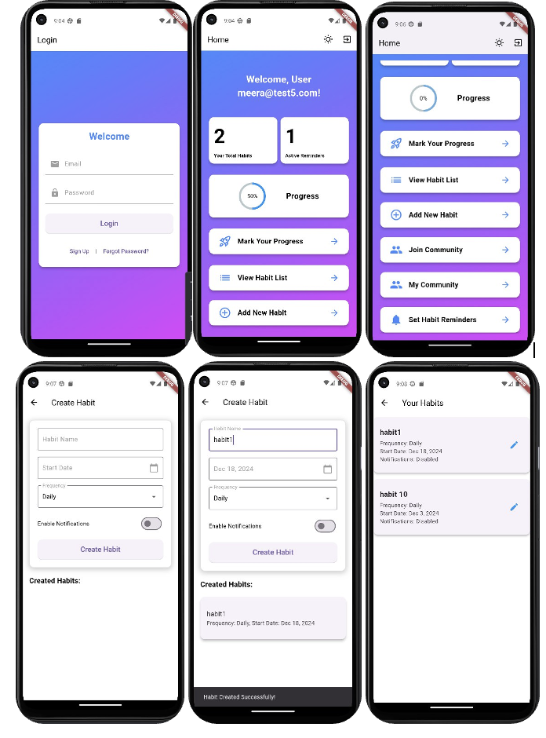
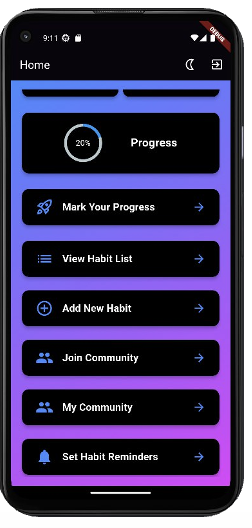

# Trackative - Habit Tracker Application  
CENG 411 - Software Engineering Project  
*Developed as a group project*

---

## Overview  
Trackative is a habit tracking application designed to help users develop and maintain positive routines. This app provides a structured platform for users to set, monitor, and track their daily habits, helping them stay motivated and committed to their goals. Through features like customizable habit creation, real-time progress tracking, and community support, Trackative helps users visualize and improve their routines over time.

---
## Screenshots

### User Interface:

  
*Screenshot 1 shows all the screens in light mode.*

  
*Screenshot 2 shows the app in dark mode.*
---

## Features  
- User Authentication: Sign up and log in using email or Google accounts.  
- Habit Creation and Customization: Create and personalize habits with specified goals, frequency, and reminders.  
- Progress Tracking: View real-time progress and track consistency via visual charts and reports.  
- Motivational Notifications: Get reminders and motivational messages to stay on track.  
- Community Support: Join habit-tracking communities to work together and motivate each other.  
- Data Reporting: Generate weekly/monthly reports to analyze habit performance and improvement.  

---

## Technologies Used  
- Flutter: The application is built using the Flutter framework for cross-platform mobile development.  
- Dart: The programming language used for Flutter development.  
- Firebase: Firebase is used for user authentication, real-time data storage, and push notifications.  
- VS Code: Visual Studio Code is the primary code editor used for development.  
- Android Studio: Android Studio is used for Android-specific development and testing.
